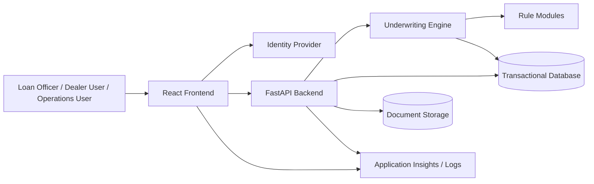
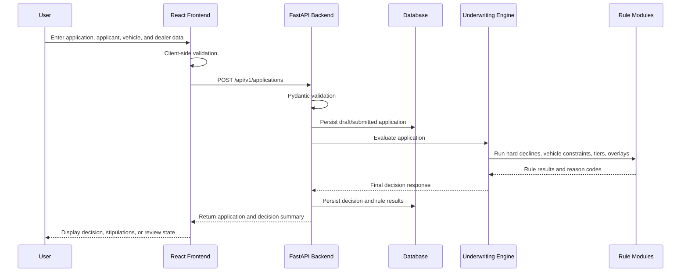
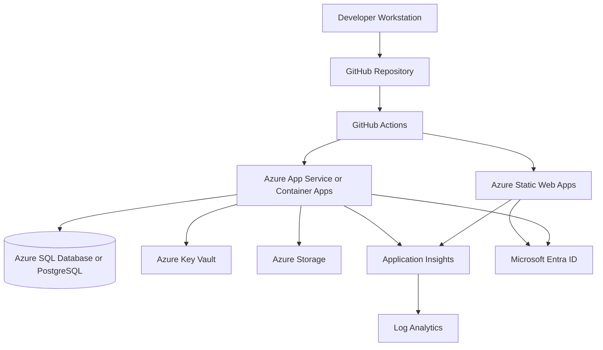

# Auto Loan Origination System Architecture

## Purpose

The Auto Loan Origination System is a full-stack application for capturing vehicle loan applications, evaluating underwriting policy, presenting decisions to users, and preserving an auditable decision record.

The architecture separates user experience, API orchestration, underwriting rules, persistence, and deployment concerns so that business policy can evolve without tightly coupling it to frontend workflows or infrastructure decisions.

## System Context

## Major Components

### Frontend Application

The frontend is a React, TypeScript, Vite, and Tailwind application under [../frontend/src](../frontend/src). It provides application intake, pipeline views, detail screens, and underwriting summaries.

Primary responsibilities:

- Render loan application workflows.
- Validate user-entered form data before submission.
- Call backend APIs through a typed client.
- Display underwriting status, risk tier, stipulations, decline reasons, and review reasons.
- Separate user-facing workflow state from backend decision state.
- Present dense operational screens for repeated underwriting and review work.

Key modules:

- [../frontend/src/App.tsx](../frontend/src/App.tsx): Application shell, routes, providers, and layout.
- [../frontend/src/api/client.ts](../frontend/src/api/client.ts): Backend API client and shared request helpers.
- [../frontend/src/pages/ApplicationsList.tsx](../frontend/src/pages/ApplicationsList.tsx): Application queue and pipeline view.
- [../frontend/src/pages/ApplicationDetail.tsx](../frontend/src/pages/ApplicationDetail.tsx): Full application and decision history view.
- [../frontend/src/pages/NewApplication.tsx](../frontend/src/pages/NewApplication.tsx): New application intake flow.
- [../frontend/src/components/UnderwritingSummary.tsx](../frontend/src/components/UnderwritingSummary.tsx): Decision summary component.

### Backend API

The backend is a FastAPI application under [../backend](../backend). It exposes the application API, validates requests, manages persistence, coordinates underwriting evaluation, and returns structured decision responses.

Primary responsibilities:

- Expose REST endpoints for applications, applicants, vehicles, dealers, decisions, and health checks.
- Validate request and response payloads with Pydantic models.
- Persist application state and decision records through SQLAlchemy.
- Invoke the underwriting engine when an application is submitted or re-evaluated.
- Enforce authentication, authorization, request validation, and error handling.
- Emit logs, metrics, traces, and correlation IDs.

Key modules:

- [../backend/main.py](../backend/main.py): FastAPI entry point, middleware, routes, and health checks.
- [../backend/database.py](../backend/database.py): Database engine, session factory, and transaction helpers.
- [../backend/models.py](../backend/models.py): SQLAlchemy domain and persistence models.

### Underwriting Engine

The underwriting engine is the decisioning core. It evaluates an application against deterministic policy rules and returns a final decision with reasons, stipulations, metrics, and audit metadata.

Primary responsibilities:

- Normalize application inputs into a rule-evaluation context.
- Compute derived values such as loan-to-value, debt-to-income, payment-to-income, vehicle age, and candidate risk tier.
- Evaluate hard declines, vehicle constraints, risk tiers, and dealer overlays.
- Apply final decision precedence.
- Return a stable, explainable decision contract to the backend API.
- Preserve enough rule metadata for auditing and regression testing.

Key modules:

- [../backend/underwriting/engine.py](../backend/underwriting/engine.py): Rule orchestration and final decision logic.
- [../backend/underwriting/rules/hard_declines.py](../backend/underwriting/rules/hard_declines.py): Terminal policy failures.
- [../backend/underwriting/rules/risk_tiers.py](../backend/underwriting/rules/risk_tiers.py): Risk segmentation.
- [../backend/underwriting/rules/vehicle_constraints.py](../backend/underwriting/rules/vehicle_constraints.py): Collateral and vehicle eligibility.
- [../backend/underwriting/rules/dealer_overlay.py](../backend/underwriting/rules/dealer_overlay.py): Dealer-specific policy adjustments.

The authoritative rules specification is [UNDERWRITING_RULES.md](UNDERWRITING_RULES.md).

### Persistence Layer

The persistence layer stores application data, applicant data, vehicle data, dealer metadata, decision results, and audit history.

Primary entities:

- Application.
- Applicant.
- Co-applicant.
- Vehicle.
- Dealer.
- Loan terms.
- Underwriting decision.
- Rule evaluation result.
- Stipulation.
- Audit event.

The initial implementation should keep transactional data in a relational database. Azure SQL Database or Azure Database for PostgreSQL are the preferred production targets. Local development may use SQLite or a containerized relational database.

### Document Storage

Document storage is used for uploaded stipulations and generated artifacts.

Examples:

- Proof of income.
- Proof of residence.
- Proof of insurance.
- Title documentation.
- Dealer contract documents.
- Generated loan package exports.

Production storage should use Azure Storage with private access, encryption, lifecycle rules, and audit logging.

### Observability

Observability spans backend, frontend, database, and deployment infrastructure.

Required telemetry:

- API request duration and status.
- Underwriting evaluation duration.
- Rule trigger counts.
- Decision outcome counts.
- Exception traces.
- Frontend route and API error telemetry.
- Correlation IDs across frontend, backend, and decision logs.
- Deployment version and rule version in logs.

Azure Application Insights and Log Analytics are the preferred telemetry targets.

## Data Flow

### New Application Submission

### Re-Evaluation Flow

Re-evaluation occurs when application facts change, documents are verified, dealer metadata changes, or an underwriter requests a new decision.

Flow:

1. User updates application data or requests re-evaluation.
2. Backend creates a new evaluation request with the current application snapshot.
3. Underwriting engine evaluates using the active rule version.
4. Backend stores the new decision as a separate decision record.
5. Frontend displays current decision and decision history.

Previous decisions should remain immutable for auditability.

### Document Flow

1. User uploads a stipulation document from the frontend.
2. Backend validates metadata, file type, size, and authorization.
3. Backend stores the document in Azure Storage.
4. Backend records document metadata and association to the application.
5. Underwriter or automated verification marks stipulations as satisfied or rejected.
6. Application may be re-evaluated or moved to funding review.

## Backend Responsibilities

The backend owns business and system integrity.

Responsibilities:

- API routing and versioning.
- Input validation and normalization.
- Transaction boundaries.
- Database persistence.
- Underwriting engine invocation.
- Decision and audit record creation.
- Authentication and authorization enforcement.
- Error handling and response consistency.
- Secrets and configuration loading.
- Telemetry emission.

The backend should not trust frontend-calculated values for policy decisions. Derived metrics used for underwriting must be recalculated server-side.

## Frontend Responsibilities

The frontend owns user workflow and presentation.

Responsibilities:

- Application intake forms.
- User-facing validation and field formatting.
- Application list and detail screens.
- Underwriting summary display.
- Stipulation upload workflows.
- Review-state indicators.
- API error presentation.
- Route-level navigation.

The frontend may perform convenience calculations for display, but the backend and underwriting engine remain authoritative for final decision values.

## Underwriting Engine Integration

The backend integrates with the underwriting engine as an internal service boundary rather than as UI logic.

Recommended integration pattern:

1. Backend receives an application submission or re-evaluation request.
2. Backend loads or creates the application aggregate.
3. Backend builds an underwriting input context.
4. Backend calls the engine with the input context and rule version.
5. Engine returns a structured decision object.
6. Backend persists the decision, rule results, and metrics.
7. Backend returns a decision summary to the frontend.

The engine should remain independent of HTTP request objects, frontend state, and database sessions. This keeps rule execution easy to test and makes future extraction into a separate service possible.

## Deployment Architecture

### Recommended Azure Topology

### Environment Model

Recommended environments:

- **Local**: Developer machine with local frontend, local backend, and local or containerized database.
- **Development**: Shared Azure environment for integration testing.
- **Staging**: Production-like Azure environment for release validation.
- **Production**: Locked-down Azure environment with approval-based deployment.

Each environment should have separate configuration, secrets, databases, storage containers, and telemetry resources.

### Hosting Options

Backend options:

- Azure App Service for a straightforward managed FastAPI deployment.
- Azure Container Apps for containerized deployment, revision management, and scale-to-zero options.

Frontend options:

- Azure Static Web Apps for static React hosting with integrated CI/CD.
- App Service static hosting if the frontend is deployed alongside broader App Service infrastructure.

Database options:

- Azure SQL Database for managed relational storage with strong enterprise operational tooling.
- Azure Database for PostgreSQL if PostgreSQL compatibility is preferred by the engineering team.

The final hosting choices should be recorded in [STACK.md](STACK.md) once selected.

## Security Architecture

Security should be built around least privilege and clear data boundaries.

Recommended controls:

- Microsoft Entra ID for user authentication.
- Role-based authorization for dealer users, loan officers, underwriters, operations, and administrators.
- Managed identity for backend access to Key Vault, database, and storage.
- Key Vault for secrets and connection strings.
- HTTPS-only frontend and backend endpoints.
- Private networking for database and storage where deployment complexity allows.
- Audit logging for application updates, decisions, document actions, and administrative changes.
- Masking of sensitive applicant data in logs and non-production fixtures.

## CI/CD Architecture

GitHub Actions should validate and deploy the application.

Continuous integration checks:

- Backend linting.
- Backend tests.
- Backend type checks.
- Frontend linting.
- Frontend type checks.
- Frontend build.
- Dependency and secret scanning.
- Infrastructure validation when infrastructure code is added.

Continuous deployment stages:

1. Build backend and frontend artifacts.
2. Deploy to development on main branch updates.
3. Run smoke tests.
4. Promote to staging with approval.
5. Run regression and release checks.
6. Promote to production with manual approval.
7. Monitor telemetry and decision metrics after release.

## Rule Versioning And Change Management

Underwriting rules are high-risk business logic and require strict change control.

Recommended practices:

- Version every rule set.
- Persist rule version with each decision.
- Require tests for each rule change.
- Keep previous decisions immutable.
- Document policy changes in [UNDERWRITING_RULES.md](UNDERWRITING_RULES.md).
- Review rule changes with business, compliance, and engineering stakeholders.
- Track decision distribution changes after deployment.

## Architecture Boundaries

### Frontend Boundary

The frontend should not contain underwriting policy. It may display rule outcomes and collect user inputs, but it should not decide approval, decline, tier, stipulation, or review status.

### Backend Boundary

The backend owns API contracts, persistence, security, and orchestration. It should call the underwriting engine through typed application-level objects rather than raw HTTP payloads.

### Engine Boundary

The engine owns rule evaluation and decision composition. It should avoid direct dependencies on web framework objects, frontend concepts, and database sessions.

### Data Boundary

The database stores authoritative application and decision history. Logs and telemetry should store identifiers, metrics, and safe reason codes rather than raw sensitive applicant details.

## Future Extension Points

Potential future architecture extensions:

- Dedicated underwriting service if rule execution needs independent scaling.
- Event-driven decision notifications through Azure Service Bus or Event Grid.
- Document verification integrations.
- Credit bureau integrations.
- Dealer portal authentication and delegated access.
- Analytics pipeline for decision trends and portfolio monitoring.
- Feature flags for phased rule rollout.
- Admin UI for policy configuration with approval workflows.

## Open Architecture Decisions

- Select Azure SQL Database or Azure Database for PostgreSQL.
- Select Azure App Service or Azure Container Apps for backend hosting.
- Select Azure Static Web Apps or App Service for frontend hosting.
- Define authentication and authorization model.
- Define infrastructure-as-code tool: Bicep or Terraform.
- Define document retention and masking rules.
- Define rule version storage and rollout strategy.
- Define whether underwriting remains in-process or becomes a standalone service later.
